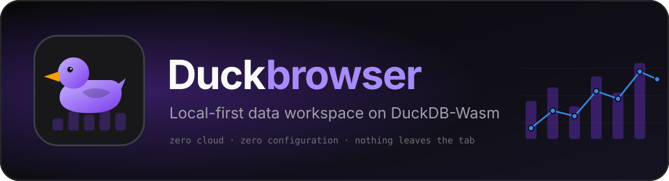
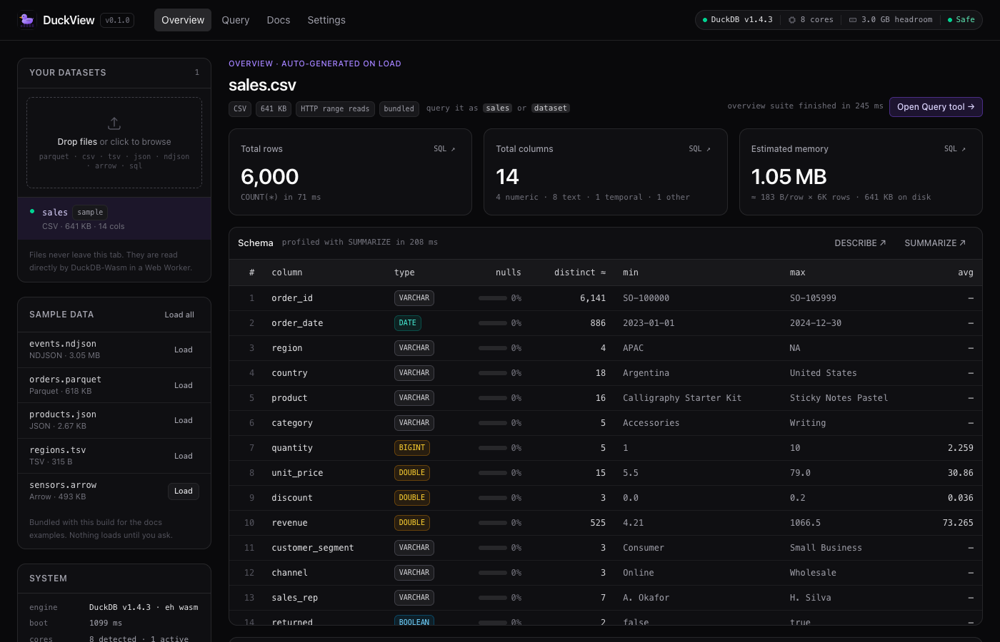
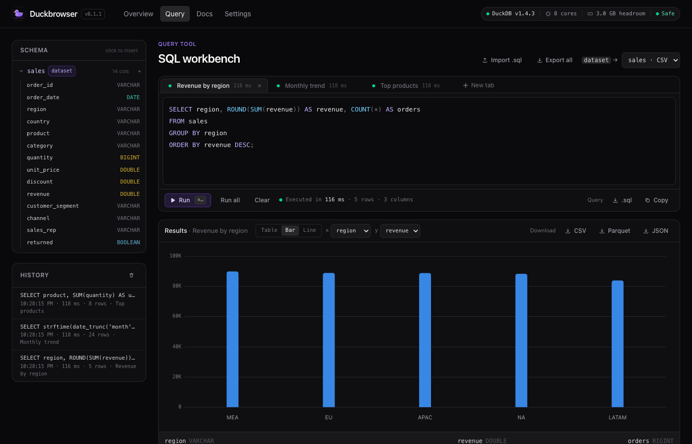
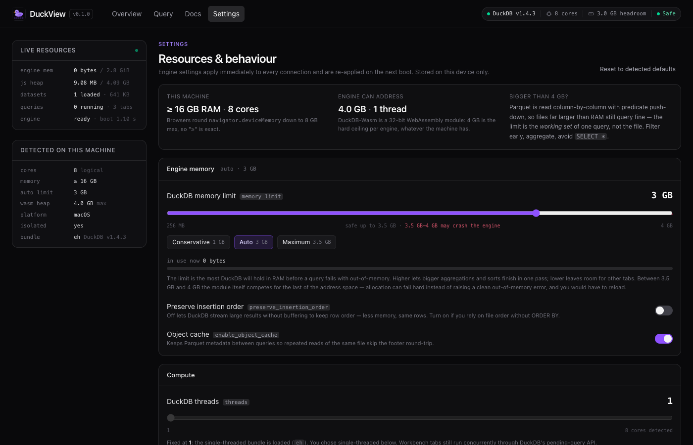
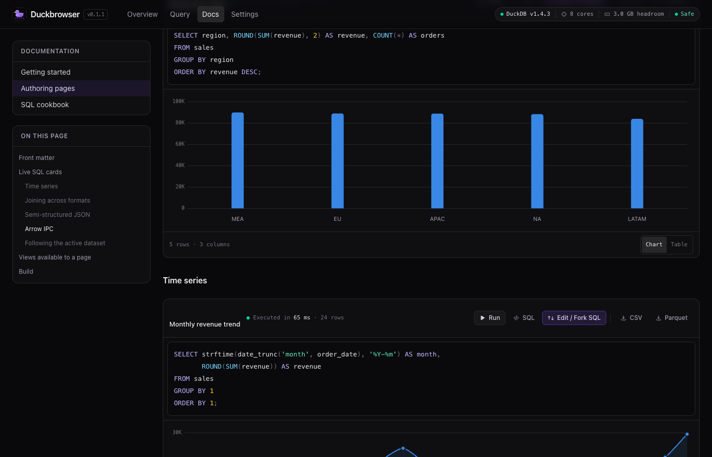
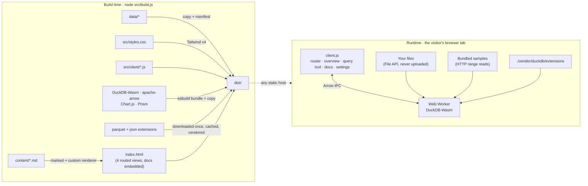

<p align="center">
  
</p>

<p align="center">
  <a href="#quick-start"></a>
  
  
  
  
  
  <a href="LICENSE"></a>
  <a href="https://github.com/contact-ajmal/DuckBrowser/releases"></a>
</p>

<p align="center">
  <strong>Drop a file. Get a profile. Ask questions in SQL. Nothing leaves your machine.</strong><br>
  <sub>Instant, hardware-aware analytics on your own computer — zero cloud compute, zero configuration, complete data privacy.</sub>
</p>

<p align="center">
  <a href="https://github.com/contact-ajmal/DuckBrowser/releases/latest/download/DuckBrowser-mac-arm64.dmg"></a>
  <a href="https://github.com/contact-ajmal/DuckBrowser/releases/latest/download/DuckBrowser-mac-x64.dmg"></a>
  <a href="https://github.com/contact-ajmal/DuckBrowser/releases/latest/download/DuckBrowser-windows-x64-setup.exe"></a>
</p>
<p align="center">
  <a href="https://contact-ajmal.github.io/DuckBrowser/"></a>
</p>
<p align="center">
  <sub>Links always point at the <a href="https://github.com/contact-ajmal/DuckBrowser/releases/latest">latest release</a> · no account, nothing else to install, no internet needed after download · <a href="#install-the-desktop-app">install instructions ↓</a> · the online version runs in your browser and is just as private</sub>
</p>

---

**DuckBrowser** turns a folder of Markdown and data files into a static website that runs a full analytical database — [DuckDB](https://duckdb.org), compiled to WebAssembly — inside the browser tab. Open it, drop in a Parquet, CSV, JSON or Arrow file, and within a second you have a schema with per-column statistics, KPIs, a preview and distribution charts. Every one of those is a real SQL query you can open in a tabbed workbench and keep going.

There is no server. There is no account. There is no upload. The `dist/` folder is plain HTML, JS and wasm that works from any static host, a `file://` USB stick, or an air-gapped machine.

<br>

<table>
  <tr>
    <td width="50%" valign="top">
      <a href="docs/screenshots/overview.png"></a>
      <p align="center"><sub><b>Overview</b> — drop a file, get KPIs, a full schema with <code>SUMMARIZE</code> stats, a preview and charts, automatically.</sub></p>
    </td>
    <td width="50%" valign="top">
      <a href="docs/screenshots/query.png"></a>
      <p align="center"><sub><b>Query</b> — tabbed SQL workbench; each tab on its own connection, charts, downloads, history, <code>.sql</code> import/export.</sub></p>
    </td>
  </tr>
  <tr>
    <td width="50%" valign="top">
      <a href="docs/screenshots/settings.png"></a>
      <p align="center"><sub><b>Settings</b> — what your machine has vs. what the engine can use; tune memory, threads, guards and behaviour.</sub></p>
    </td>
    <td width="50%" valign="top">
      <a href="docs/screenshots/docs.png"></a>
      <p align="center"><sub><b>Docs</b> — Markdown pages where every <code>```sql</code> fence is a live, forkable query card.</sub></p>
    </td>
  </tr>
</table>

<br>

## Table of contents

- [What makes DuckBrowser different](#what-makes-duckbrowser-different)
- [Highlights](#highlights)
- [The four pages](#the-four-pages)
- [How it works](#how-it-works)
- [Quick start](#quick-start)
- [Desktop app](#desktop-app) — [download](#download) · [install](#install-the-desktop-app)
- [Bring your data](#bring-your-data)
- [Write docs with live SQL](#write-docs-with-live-sql)
- [Resources, limits and the honest numbers](#resources-limits-and-the-honest-numbers)
- [Privacy and the offline guarantee](#privacy-and-the-offline-guarantee)
- [Deploying](#deploying)
- [Testing](#testing)
- [Project layout](#project-layout)
- [Configuration](#configuration)
- [Known limitations and roadmap](#known-limitations-and-roadmap)
- [Built with](#built-with)
- [License](#license)

---

## What makes DuckBrowser different

Most data tools make you choose between *powerful* and *private*, or between *instant* and *flexible*. DuckBrowser sits in a corner few tools occupy: a real columnar SQL engine, in the browser, that starts working the moment a file lands — and that you can publish as a static site.

| | **DuckBrowser** | Cloud BI<br><sub>Metabase, Mode, Looker Studio</sub> | Notebooks<br><sub>Jupyter, Hex</sub> | Desktop DB tools<br><sub>DBeaver, DuckDB CLI</sub> | Bare DuckDB-Wasm shell |
|---|:---:|:---:|:---:|:---:|:---:|
| Where queries run | **your browser tab** | their servers | a kernel you manage | your machine | your browser tab |
| Data leaves your machine | **never** — no upload, no telemetry, no CDN calls | yes | depends | no | usually fetches extensions from a CDN |
| Setup before first insight | **none** — drop a file | connect a warehouse, model, permissions | install Python + libraries | install, configure driver | write SQL first |
| Automatic profile on load | **yes** — KPIs, schema stats, preview, charts | dashboards you build | code you write | no | no |
| Interactive follow-up | **tabbed SQL workbench, charts, exports** | query builder | code cells | SQL editor | REPL |
| Docs that *run* | **Markdown → live SQL cards** | no | notebooks, not docs | no | no |
| Output | **static site** (hosted on GitHub Pages, or anywhere) **and a desktop app** (DMG / Windows installer) | hosted service | notebook file / hosted app | native app | static |
| Formats | **Parquet, CSV, TSV, JSON, NDJSON, Arrow** | via connectors | via libraries | via drivers | Parquet, CSV, JSON |
| Hardware awareness | **detects cores & RAM, tunes the engine, warns on oversized files** | n/a | manual | manual | manual |
| Cost | **free, no infrastructure** | per seat / per query | compute | free | free |

Three ideas do most of the work:

1. **Analysis starts before you type.** The moment a dataset mounts, an *overview suite* runs — `COUNT(*)`, `DESCRIBE`, `SUMMARIZE`, a preview, a time series and top-N distributions — chosen by looking at the column types. You read results, not a blank editor.
2. **Every result is a starting point.** Each card has **Edit / Fork SQL**. It opens the exact query in a workbench tab, with its chart configuration, so "why is that number high?" is one click away.
3. **Docs are executable.** A Markdown page with ```` ```sql ```` fences becomes a page of live cards. Write a data guide once; every reader gets fresh results from their own machine.

## Highlights

- **Six formats, one drop zone** — Parquet (column-pruned, predicate push-down), CSV / TSV (dialect sniffing), JSON (arrays *and* API-style wrapper objects, automatically unnested), NDJSON, Arrow IPC (file or stream). Files are read through the browser's `File` API — no copy into memory, no upload.
- **Automatic overview** — 3 KPI cards (rows, columns, estimated in-memory size with a safety verdict), a schema card with type badges, null bars, distinct counts, min/max/avg, a 10-row preview, rows-per-month for the first date column and top-5 charts for low-cardinality text columns.
- **Tabbed SQL workbench** — every tab owns its own DuckDB connection, so tabs run *concurrently* through DuckDB's pending-query API and each has its own **Stop**. Table / bar / line results with axis pickers, downloads as CSV · Parquet · JSON, the query as `.sql`, history, a schema explorer that inserts identifiers, `.sql` import (drag a file in) and multi-tab export/import.
- **Hardware-aware** — reads `hardwareConcurrency` and `deviceMemory`, sets DuckDB's `memory_limit`, and rates each dataset green / yellow / red against it. The Settings page lets you retune live, right up to the 4 GB ceiling of a 32-bit wasm heap — and tells you that's the ceiling.
- **Opt-in multi-core engine** — DuckDB's threaded wasm build runs scans, joins and aggregations across all cores (~3× on an 8-core laptop), shipped with a service worker that enables it on hosts that can't send isolation headers.
- **Genuinely offline** — DuckDB's `parquet` and `json` extensions are vendored into the bundle instead of fetched from `extensions.duckdb.org`. The smoke test blocks every non-localhost request for the whole run to prove it.
- **Polished, dark-first UI** — zinc palette, violet accent, skeleton loaders, sticky table headers, keyboard shortcuts (`⌘/Ctrl+Enter`), validated chart palette that is colour-blind safe.

## The four pages

DuckBrowser is a single HTML file with four routed views (`#/`, `#/query`, `#/docs/…`, `#/settings`). Routing stays inside the page on purpose: the DuckDB worker and any files you dropped in survive navigation.

### 1 · Overview `#/`

The landing page. Starts empty and waits for your file; the samples bundled with a build are listed under *Sample data* and only load on request. Once a dataset is active:

| Section | What you get | Behind it |
|---|---|---|
| KPI cards | total rows · total columns (with numeric/text/temporal mix) · estimated memory + on-disk size | `COUNT(*)`, `DESCRIBE`, a sampled width estimate |
| Safety badge | green *Safe* · yellow *High RAM footprint* · red *Exceeds headroom*, with advice | estimate ÷ current `memory_limit`, thresholds adjustable |
| Schema | every column with type badge, null-percentage bar, ≈distinct, min, max, avg | `DESCRIBE` instantly, `SUMMARIZE` fills in |
| Data preview | first 10 rows, typed headers, sticky header, horizontal scroll | `SELECT * … LIMIT 10` |
| Distributions | rows per month for the first `DATE`/`TIMESTAMP` column; top-5 counts for up to two low-cardinality text columns | chosen from the profile |

Every card has **Run**, **SQL** (edit in place — a *modified* badge and reset appear), **Edit / Fork SQL**, **CSV** and **Parquet**.

### 2 · Query `#/query`

A workbench built for "several questions at once":

- **Tabs** with their own connections. *Run all* starts every tab; *Stop* cancels one without touching the others. Queued tabs (over the concurrency limit) show an amber dot.
- **Results** as a table or a bar/line chart with x / y pickers; a small view toggle keeps the table one click away from any chart.
- **Downloads** produced by DuckDB itself (`COPY … TO`), so they always contain the full result even when the table view is truncated.
- **Import .sql** — one file → one tab; a file produced by *Export all* (sections separated by `-- @duckbrowser-tab: name`) restores all its tabs. Dropping `.sql` files anywhere on the page does the same.
- **Schema explorer** — click a view or a column to insert it at the cursor. **History** — the last N runs with timing; click to reopen.
- The active dataset selector drives the `dataset` alias, so one query can be pointed at different files.

### 3 · Docs `#/docs`

Rendered from `content/*.md` at build time. Sidebar with the page list and an on-page table of contents; live cards execute only when their page is opened. Cards that reference a sample dataset that isn't loaded show a **Load sample and re-run** button instead of a bare error.

### 4 · Settings `#/settings`

Resource controls with a live readout (engine memory in use, JS heap, datasets loaded, queries running) and what was detected on the machine. Details in [Resources, limits and the honest numbers](#resources-limits-and-the-honest-numbers).

## How it works



1. **Build.** `src/build.js` parses each Markdown file with `marked`; a custom renderer turns ```` ```sql ```` fences into `<duck-query>` elements (the SQL travels as escaped text, so the page degrades to a plain code block without JavaScript). Datasets are copied and described in `manifest.json`. Tailwind compiles the stylesheet. DuckDB-Wasm is bundled together with `apache-arrow` by esbuild (it imports arrow as a bare specifier, which browsers can't resolve), and the DuckDB extensions are downloaded once, cached in `node_modules/.cache`, and shipped under `vendor/duckdb/extensions/`.
2. **Boot.** The client starts DuckDB-Wasm in a Web Worker, applies hardware-derived tuning (`memory_limit`, insertion order, object cache), points DuckDB's extension repository at the local copy, and loads `parquet` and `json`. About one second on a laptop.
3. **Mount.** Dropped files are registered through the browser's `File` API and exposed as views named after the file (`My Export (1).parquet` → `my_export_1`). Bundled samples are registered by URL and read with HTTP range requests, so a Parquet query touches only the columns it needs. Arrow IPC files are decoded and inserted as tables. `dataset` is always an alias for the active one.
4. **Overview.** Six queries fire in a fixed order (preview → count → time series → `SUMMARIZE` → memory estimate → top-5s); each card paints as its result arrives.
5. **Workbench.** Each tab creates its own connection and runs statements through DuckDB's *pending query* API, which executes in time slices — that's what lets tabs interleave on one worker and be cancelled individually.

## Quick start

```bash
git clone https://github.com/contact-ajmal/DuckBrowser.git
cd DuckBrowser
npm install
npm run data     # (optional) regenerate the deterministic sample datasets in ./data
npm run build    # content/ + data/ → dist/   (downloads the two DuckDB extensions once)
npm run dev      # serve dist/ at http://localhost:4173
```

Then open the URL, drop a file onto the page, and read.

`npm start` runs build + dev in one go. `npm test` builds and runs the headless smoke test (see [Testing](#testing)).

> **Requirements:** Node 18+ for the build. Any browser from the last few years for the site (Chrome, Edge, Firefox, Safari — WebAssembly with exception handling). No Python, no Docker, no database server.

## Desktop app

Don't want to run a build or a server? DuckBrowser ships as a **native desktop app** — the same workspace wrapped in an Electron shell, so it opens like any other application and works with no network at all. Download, install, drop a file.

### Download

| Your computer | Download | Size |
| --- | --- | --- |
| **Mac with Apple Silicon** (M1, M2, M3, M4 — 2020 or later) | [DuckBrowser-mac-arm64.dmg](https://github.com/contact-ajmal/DuckBrowser/releases/latest/download/DuckBrowser-mac-arm64.dmg) | ~140 MB |
| **Mac with an Intel processor** | [DuckBrowser-mac-x64.dmg](https://github.com/contact-ajmal/DuckBrowser/releases/latest/download/DuckBrowser-mac-x64.dmg) | ~145 MB |
| **Windows 10 / 11, 64-bit** | [DuckBrowser-windows-x64-setup.exe](https://github.com/contact-ajmal/DuckBrowser/releases/latest/download/DuckBrowser-windows-x64-setup.exe) | ~120 MB |
| **Any computer, no install** | [contact-ajmal.github.io/DuckBrowser](https://contact-ajmal.github.io/DuckBrowser/) | runs in the browser — same code, same privacy |

Not sure which Mac you have? Apple menu → *About This Mac*: "Chip: Apple M…" means Apple Silicon; "Processor: Intel…" means Intel.

All versions, release notes and checksums: **[github.com/contact-ajmal/DuckBrowser/releases](https://github.com/contact-ajmal/DuckBrowser/releases)**. The link [`/releases/latest`](https://github.com/contact-ajmal/DuckBrowser/releases/latest) always points at the newest version.

### Install the desktop app

<details open>
<summary><strong>macOS</strong></summary>

1. Open the downloaded `.dmg`. A window appears with the DuckBrowser icon and an *Applications* folder.
2. Drag **DuckBrowser** onto **Applications**.
3. Eject the DuckBrowser disk image (drag it to the Trash, or click ⏏ in Finder's sidebar).
4. Open **Applications → DuckBrowser**.
5. **The first time only**, macOS will object, because the app isn't signed with a paid Apple Developer certificate. What you see depends on the macOS version:
   - *"DuckBrowser" can't be opened because Apple could not verify it is free of malware* → **right-click** (or Control-click) the app → **Open** → **Open**. Or **System Settings → Privacy & Security** → scroll down → **Open Anyway**.
   - *"DuckBrowser" is damaged and can't be opened. You should move it to the Bin* → this is the same thing worded worse (the file isn't damaged). Open **Terminal** and run:
     ```
     xattr -cr /Applications/DuckBrowser.app
     ```
     then open the app normally.

   Either way it's a one-time step; afterwards it opens like any other app.
6. Drop a Parquet / CSV / JSON / Arrow file onto the window. That's it.

</details>

<details open>
<summary><strong>Windows</strong></summary>

1. Run the downloaded `DuckBrowser-…-setup.exe`.
2. **SmartScreen** shows *Windows protected your PC* because the installer isn't signed with a code-signing certificate. Click **More info** → **Run anyway**.
3. Follow the installer: choose the folder (default is fine), and whether you want a desktop shortcut.
4. Launch **DuckBrowser** from the Start menu or the desktop shortcut.
5. Drop a Parquet / CSV / JSON / Arrow file onto the window.

To uninstall: *Settings → Apps → DuckBrowser → Uninstall* (or Control Panel → Programs).

</details>

### Verify a download (optional)

Every release includes `SHA256SUMS.txt`. Compare it with what you downloaded:

```bash
# macOS
shasum -a 256 ~/Downloads/DuckBrowser-mac-arm64.dmg
```
```powershell
# Windows (PowerShell)
Get-FileHash "$env:USERPROFILE\Downloads\DuckBrowser-windows-x64-setup.exe" -Algorithm SHA256
```

### What the app does with your data

Nothing you'd have to trust it with. Files you drop in are read by DuckDB inside the app's window through the browser File API — never copied elsewhere, never uploaded. The app makes **no network requests**: the analytics engine, its extensions and every library are inside the installer, so it works on a machine with no internet at all. Downloads (CSV / Parquet / JSON / `.sql`) open the native *Save as…* dialog; links open in your default browser.

Under the hood the app serves the same `dist/` bundle as the website over a private `duckbrowser://` scheme with correct MIME types, byte-range support (so Parquet samples are read by column) and cross-origin-isolation headers (so the opt-in multi-threaded engine is available), in a sandboxed renderer with no Node access.

### System requirements

- macOS 11 Big Sur or later (Apple Silicon or Intel) · Windows 10 or 11, 64-bit
- ~400 MB of disk space; RAM as you like — the engine uses up to 4 GB (see [Resources](#resources-limits-and-the-honest-numbers))
- No other software needed

### Build the installers yourself

```bash
npm run dist:mac    # release/DuckBrowser-<version>-mac-{arm64,x64}.dmg
npm run dist:win    # release/DuckBrowser-<version>-windows-x64-setup.exe   (works on a Mac too)
npm run desktop     # just run the app from the source tree
```

Releases are produced by [`.github/workflows/release.yml`](.github/workflows/release.yml): pushing a `v*` tag runs the smoke test, builds natively on macOS and Windows runners, and attaches the installers plus `SHA256SUMS.txt` to a GitHub Release.

## Bring your data

Drop files anywhere on the Overview page, or use *Choose a file…*. Drop several at once; the first becomes active.

| Format | Extensions | How it is read | Notes |
|---|---|---|---|
| Parquet | `.parquet` | `read_parquet` | Column-pruned with predicate push-down: files much larger than RAM query fine when each query's working set fits |
| CSV / TSV | `.csv` `.tsv` | `read_csv_auto` | Header and dialect sniffing; streamed |
| JSON | `.json` | `read_json_auto` | Arrays of objects. Nested objects become `STRUCT`s, lists become `LIST`s. Files over 16 MB are retried with a larger `maximum_object_size`; a wrapper object like `{"status": "ok", "data": [ … ]}` is unnested into rows automatically (the overview shows a *rows from data[]* badge) |
| NDJSON | `.ndjson` `.jsonl` | `read_json_auto` | Newline-delimited, streamed |
| Arrow IPC | `.arrow` `.feather` `.ipc` | Arrow reader → DuckDB table | Both the file layout (with footer) and the stream layout, from any writer |
| SQL | `.sql` `.txt` | — | Not data: opens as workbench tabs |

Once loaded, a dataset is a view you can query by name from any tab or docs card; `dataset` follows the sidebar selection. Hover a dataset and click **×** to unload it.

## Write docs with live SQL

Every `content/*.md` file becomes a page under **Docs**. Standard GitHub-flavoured Markdown, plus:

````markdown
---
title: Sales review
description: Where revenue comes from, by region and month
order: 20
---

# Revenue by region

```sql {title="Revenue by region" chart=bar x=region y=revenue}
SELECT region, ROUND(SUM(revenue)) AS revenue
FROM sales
GROUP BY 1
ORDER BY 2 DESC;
```
````

| Option | Values | Effect |
|---|---|---|
| `title` | text | Card heading |
| `chart` | `bar` · `line` · `auto` · `none` | Draw a chart above the result table (`auto` picks by shape and defaults to the table view) |
| `x`, `y` | column names | Chart axes; `y` accepts a comma-separated list for multiple series |
| `autorun` | `false` | Wait for a manual Run |
| `limit` | number | Rows rendered in the table (downloads are always complete) |
| `static` | `true` | Plain code block, no execution |

Cards run only when their page is opened, so a large docs site costs nothing until it is read. The full authoring guide — joins across formats, nested JSON, Arrow, the `dataset` alias — ships inside the app under **Docs → Authoring pages**.

## Resources, limits and the honest numbers

DuckBrowser detects the machine and tunes DuckDB, then lets you override everything on the **Settings** page. It also refuses to pretend.

**The 4 GB ceiling.** DuckDB-Wasm is a 32-bit WebAssembly module. Its address space tops out at **4 GB per engine instance**, regardless of how much RAM the machine has. A 16 GB laptop still gets at most 4 GB *per engine*, and the last 512 MB are shared with the engine module itself. The memory slider runs from 256 MB to that ceiling, with the 3.5–4 GB band marked as unsafe. Files far bigger than 4 GB still query fine as long as each query's *working set* fits — Parquet is read column by column, so filter early, aggregate, and avoid `SELECT *`.

**Threads.** The default engine is single-threaded and supports every format. The **multi-threaded engine** (Settings → Compute → Engine build) is an opt-in: on an 8-core laptop it ran a 30M-row group-by in 36 ms instead of 114 ms, a `COUNT(DISTINCT)` in 79 ms instead of 402 ms. Two caveats, both stated on the page: it needs the page to be cross-origin isolated (the dev server sends the headers; a bundled service worker adds them on hosts that can't), and in DuckDB-Wasm 1.32 the threaded build cannot load the Parquet and JSON extensions — an upstream packaging issue — so it is for CSV, TSV, Arrow and in-memory tables. The thread count is applied when the engine starts, so it takes effect on reload; resizing a live pthread pool deadlocks the wasm build, and we would rather not ship a control that can freeze the engine.

| Setting | Applies | Notes |
|---|---|---|
| `memory_limit` | live | slider + *Conservative / Auto / Maximum* presets derived from device memory; usage bar; unsafe-zone warning |
| `preserve_insertion_order` | live | off (default) lets DuckDB stream large results with less memory |
| `enable_object_cache` | live | caches Parquet metadata between queries |
| Engine build · threads | on reload | single-threaded (default) or multi-threaded (experimental) · 1 … cores |
| Max concurrent queries · query timeout | live | workbench guards: extra tabs queue; a runaway query is stopped after N seconds |
| Table rows · `SUMMARIZE` on load · estimate sample size · charts · badge thresholds · history size · sample autoload | live | workspace behaviour, stored in `localStorage` |

The navbar pill always shows the engine state, detected cores, current memory headroom and the active dataset's safety badge; clicking the memory segment opens Settings.

## Privacy and the offline guarantee

- **Nothing is uploaded.** Files are read by DuckDB through the browser's `File` API inside the tab. Close the tab and they are gone.
- **No telemetry, no accounts, no cookies.** Workbench tabs, history and settings are kept in `localStorage` on your device; *Clear everything* wipes them.
- **No CDN, no extension downloads.** DuckDB-Wasm normally fetches its `parquet` and `json` extensions from `extensions.duckdb.org` on first use. DuckBrowser's build vendors those files and points the engine at its own copy (`SET custom_extension_repository`). The smoke test blocks every request that isn't `localhost` for the entire run and asserts that none was attempted.
- **Works air-gapped.** Build once with internet (the same requirement as `npm install`), then serve `dist/` from anywhere — including a machine with no network at all.

## Deploying

`dist/` is static. Copy it to any web server, object storage bucket, GitHub Pages, Netlify, an intranet share, or a USB stick.

This repository deploys itself to **GitHub Pages** on every push to `main` via [`.github/workflows/pages.yml`](.github/workflows/pages.yml): **https://contact-ajmal.github.io/DuckBrowser/**. Nothing about the hosted copy is different — your files still never leave your browser.

- **Single-threaded engine (default):** works everywhere with no configuration.
- **Multi-threaded engine:** needs the page to be cross-origin isolated. Either send two headers from your host —
  ```
  Cross-Origin-Opener-Policy: same-origin
  Cross-Origin-Embedder-Policy: require-corp
  ```
  (`src/serve.json` does this for `npm run dev`) — or leave *Settings → add isolation headers with a service worker* on, and the bundled `coi-sw.js` adds them on first visit with one reload. Service workers require HTTPS or `localhost`.
- Bundled sample data is read with HTTP range requests when the host supports them, and falls back to a full download when it doesn't.

## Testing

```bash
npm test            # build, serve dist/ on a temporary port, run the headless smoke test
npm run test:live   # the same checks against an already-running `npm run dev`
```

`scripts/smoke-test.mjs` drives the built site in headless Chrome (via `playwright-core`, using the Chrome already installed — no browser download) and runs 87 checks: empty boot, loading samples, the overview KPIs / schema card / preview / charts, fork → Query, concurrent tabs and Stop, tab close/rename/persistence, `.sql` import (single and multi-tab) and drop, chart types and axes, CSV / Parquet / JSON / `.sql` downloads, history and the schema explorer, every docs page's live cards, the Settings page (live `memory_limit` reflected in the status pill, the 4 GB ceiling and unsafe warning, presets, toggles, persistence across reload, reset), the opt-in threaded engine (loads under COOP/COEP, stored thread count, CSV works, Parquet fails fast with a hint), query guards, large JSON files (17 MB array, wrapper object), a dropped data file, unloading the active dataset — and that no request left `localhost` at any point.

Add `?debug` to the URL when testing by hand to get DuckDB's own console logger.

## Project layout

```
content/               Markdown doc pages (front matter: title, description, order)
desktop/main.js        Electron shell (private duckbrowser:// scheme, range support, isolation headers)
build/icon.png         App icon source (electron-builder derives .icns / .ico)
.github/workflows/     release.yml — test + build installers on tag push
data/                  Sample datasets — each file is offered as a sample, mounted on request
docs/                  README assets (brand SVGs, screenshots)
scripts/
  generate-data.js     Deterministic sample data (Parquet written by DuckDB, Arrow by apache-arrow)
  smoke-test.mjs       Headless end-to-end test
src/
  build.js             Build pipeline
  template.html        Page shell: navbar + four routed views
  styles.css           Tailwind v4 entry (dark-first zinc palette, violet accent)
  vendor-entry.js      esbuild entry bundling DuckDB-Wasm + apache-arrow into one ESM file
  serve.json           COOP/COEP headers for the dev server
  coi-sw.js            Service worker that adds those headers on hosts that can't
  client.js            Browser entry point
  client/
    router.js          Hash router (#/, #/query, #/docs/<page>, #/settings, ?ds=<id>)
    engine.js          DuckDB-Wasm boot, tuning, mounting, sessions, exports, extensions
    hardware.js        Detection, tuning statements, presets, feasibility rating
    overview.js        The auto-run overview suite
    query-tool.js      Tabbed workbench
    docs.js            Docs view (page list, TOC, lazy card execution)
    settings-page.js   Settings view
    settings.js        Persisted settings store (+ legacy key migration)
    duck-query.js      <duck-query> Web Component
    editor.js          Prism-highlighted SQL editor
    render.js          Tables, charts (Chart.js), skeletons, errors
    datasets.js        Sidebar: your datasets, samples, drag-and-drop
    status.js          Navbar status pill + System panel
    toast.js           Notifications
    format.js          Formatting and type helpers
dist/                  Build output (static, ~80 MB: two wasm engines, extensions, libraries)
release/               Desktop installers (electron-builder output, git-ignored)
```

## Configuration

`package.json`:

```json
"duckbrowser": {
  "title": "DuckBrowser",
  "autoload": false,
  "defaultDataset": "sales"
}
```

| Key | Meaning |
|---|---|
| `title` | Name shown in the navbar and page title |
| `autoload` | `true` mounts every file in `data/` at boot (the classic dashboard behaviour); `false` (default) lists them as samples and starts empty for the user's own files |
| `defaultDataset` | Which sample becomes active when samples are auto-loaded or deep-linked |

Per-visitor preferences live in the Settings page. Deep links: `#/query?ds=orders` opens the workbench with that sample loaded and active.

## Known limitations and roadmap

- **Memory is capped at 4 GB per engine** by 32-bit WebAssembly. A Memory64 build of DuckDB-Wasm would lift this; DuckBrowser will pick it up when it exists.
- **The threaded engine can't read Parquet/JSON yet** (DuckDB-Wasm 1.32 publishes those extensions for unshared memory). Tracked upstream; the code path in DuckBrowser is ready and the Settings page will stop warning when a fixed release lands.
- **Files persist only for the tab's lifetime.** Persisting dropped files with the Origin Private File System is on the list.
- **One engine per tab.** Cross-tab sharing (SharedWorker) is not attempted.
- Ideas being considered: saved dashboards, pivot builder, CSV/Parquet conversion in place, chart export as PNG.

## Built with

[DuckDB](https://duckdb.org) and [DuckDB-Wasm](https://github.com/duckdb/duckdb-wasm) · [Apache Arrow](https://arrow.apache.org) · [Chart.js](https://www.chartjs.org) · [Prism](https://prismjs.com) · [Tailwind CSS](https://tailwindcss.com) · [marked](https://marked.js.org) · [esbuild](https://esbuild.github.io) · [serve](https://github.com/vercel/serve) · [Playwright](https://playwright.dev) for the smoke test.

## License

[MIT](LICENSE) © 2026 Ajmal Baba. DuckDB, Apache Arrow, Chart.js, Prism, Tailwind CSS and the other bundled libraries remain under their own licenses.

<p align="center">
  <br>
  <sub>Made for people who would rather look at their data than upload it.</sub>
</p>
